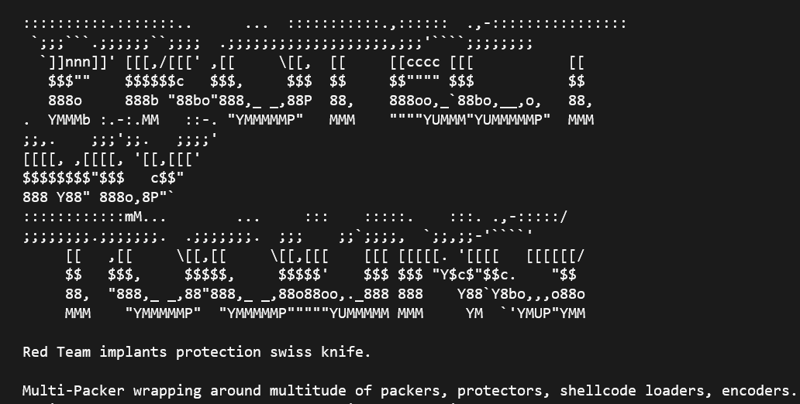
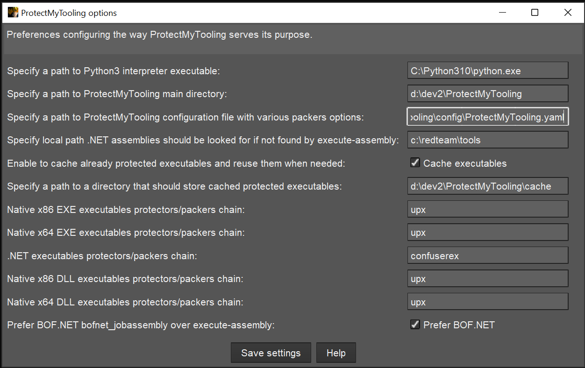

# ProtectMyTooling - a wrapper around Packers, Protectors and Script Obfuscators

Script that builds around supported packers & protectors to produce complex protected binaries and scripts.
Your perfect companion in Malware Development CI/CD pipeline, **helping you watermark your artifacts and collect IOCs**

With `ProtectMyTooling` you can quickly obfuscate your binaries without having to worry about clicking through all the Dialogs, interfaces, menus, creating projects to obfuscate a single binary, clicking through all the options available and wasting time about all that nonsense. It takes you straight to the point - to obfuscate your tool.

Aim is to offer the most convenient interface possible and allow to leverage _a daisy-chain of multiple packers_ combined on a single binary.

That's right - we can launch `ProtectMyTooling` with several packers at once:

```
C:\> py ProtectMyTooling.py hyperion,upx mimikatz.exe mimikatz-obf.exe
```

The above example will firstly pass `mimikatz.exe` to the Hyperion for obfuscation, and then the result will be provided to UPX for compression. Resulting with `UPX(Hyperion(file))`


## Features

- Supports multiple different PE Packers, .NET Obfuscators, Shellcode Loaders/Builders
- Allows daisy-chaining packers where output from a packer is passed to the consecutive one: `callobf,hyperion,upx` will produce artifact `UPX(Hyperion(CallObf(file)))`
- Collects IOCs at every obfuscation step so that auditing & Blue Team requests can be satisfied
- Offers functionality to inject custom Watermarks to resulting PE artifacts - in DOS Stub, Checksum, as a standalone PE Section, to file's Overlay
- Comes up with a handy Cobalt Strike aggressor script bringing `protected-upload` and `protected-execute-assembly` commands
- Straightforward command line usage


## Installation

This tool was designed to work on Windows, as packers are delivered in EXE format. 
Some features may work however on Linux just fine, nonetheless that support is not provided.

Installation is simple and pretty much boils down to requirements installation:

```
C:\> pip install -r requirements.txt
```

For `ScareCrow` packer to run on Windows 10, there needs to be `WSL` installed and `bash.exe` available (in `%PATH%`).
Then, in WSL one needs to have `golang` installed in version at least `1.16`:

```
cmd> bash
bash$ sudo apt update ; sudo apt upgrade -y ; sudo apt install golang=2:1.18~3 -y
```


## Usage

Before `ProtectMyTooling`'s first use, it is essential to adjust program's YAML configuration file `ProtectMyTooling.yaml`. 
The order of parameters processal is following:

- Firstly default parameters are used
- Then they're overwritten by values coming from YAML
- Finally, whatever is provided in command line will overwrite corresponding values

There, supported packer paths and options shall be set to enable 


### Scenario 1: Simple ConfuserEx obfuscation

Usage is very simple, all it takes is to pass the name of obfuscator to choose, input and output file paths:

```
C:\> py ProtectMyTooling.py confuserex Rubeus.exe Rubeus-obf.exe

    ::::::::::.:::::::..      ...  :::::::::::.,::::::  .,-::::::::::::::::
     `;;;```.;;;;;;``;;;;  .;;;;;;;;;;;;;;;\''';;;;\'\''',;;;'````;;;;;;;;\'\'''
      `]]nnn]]' [[[,/[[[' ,[[     \[[,  [[     [[cccc [[[           [[
       $$$""    $$$$$$c   $$$,     $$$  $$     $$"""" $$$           $$
       888o     888b "88bo"888,_ _,88P  88,    888oo,_`88bo,__,o,   88,
    .  YMMMb :.-:.MM   ::-. "YMMMMMP"   MMM    """"YUMMM"YUMMMMMP"  MMM
    ;;,.    ;;;';;.   ;;;;'
    [[[[, ,[[[[, '[[,[[['
    $$$$$$$$"$$$   c$$"
    888 Y88" 888o,8P"`
    ::::::::::::mM...        ...     :::    :::::.    :::. .,-:::::/
    ;;;;;;;;\'''.;;;;;;;.  .;;;;;;;.  ;;;    ;;`;;;;,  `;;,;;-'````'
         [[   ,[[     \[[,[[     \[[,[[[    [[[ [[[[[. '[[[[   [[[[[[/
         $$   $$$,     $$$$$,     $$$$$'    $$$ $$$ "Y$c$"$$c.    "$$
         88,  "888,_ _,88"888,_ _,88o88oo,._888 888    Y88`Y8bo,,,o88o
         MMM    "YMMMMMP"  "YMMMMMP"""""YUMMMMM MMM     YM  `'YMUP"YMM

    Red Team implants protection swiss knife.

    Multi-Packer wrapping around multitude of packers, protectors, shellcode loaders, encoders.
    Mariusz Banach / mgeeky '20-'22, <mb@binary-offensive.com>
    v0.13

[.] Processing x86 file: "\Rubeus.exe"
[.] Generating output of ConfuserEx(<file>)...

[+] SUCCEEDED. Original file size: 417280 bytes, new file size ConfuserEx(<file>): 756224, ratio: 181.23%
```

### Scenario 2: Simple ConfuserEx obfuscation followed by artifact test

One can also obfuscate the file and immediately attempt to launch it (also with supplied optional parameters) to ensure it runs fine with options `-r --cmdline CMDLINE`:

```
C:\> py ProtectMyTooling.py confuserex Rubeus.exe Rubeus-obf.exe -r --cmdline "hash /password:foobar"

    [...]

[.] Processing x86 file: "\Rubeus.exe"
[.] Generating output of ConfuserEx(<file>)...

[+] SUCCEEDED. Original file size: 417280 bytes, new file size ConfuserEx(<file>): 758272, ratio: 181.72%


Running application to test it...

   ______        _
  (_____ \      | |
   _____) )_   _| |__  _____ _   _  ___
  |  __  /| | | |  _ \| ___ | | | |/___)
  | |  \ \| |_| | |_) ) ____| |_| |___ |
  |_|   |_|____/|____/|_____)____/(___/

  v2.0.0


[*] Action: Calculate Password Hash(es)

[*] Input password             : foobar
[*]       rc4_hmac             : BAAC3929FABC9E6DCD32421BA94A84D4

[!] /user:X and /domain:Y need to be supplied to calculate AES and DES hash types!
```

### Scenario 3: Complex malware obfuscation with watermarking and IOCs collection

Below use case takes `beacon.exe` on input and feeds it consecutively into `CallObf` -> `UPX` -> `Hyperion` packers.

Then it will inject specified `fooobar` watermark to the final generated output artifact's DOS Stub as well as modify that artifact's checksum with value `0xAABBCCDD`.

Finally, ProtectMyTooling will capture all IOCs (md5, sha1, sha256, imphash, and other metadata) and save them in auxiliary CSV file. That file can be used for IOC matching as engagement unfolds.

```
PS> py .\ProtectMyTooling.py callobf,upx,hyperion beacon.exe beacon-obf.exe -i -I operation_chimera -w dos-stub=fooobar -w checksum=0xaabbccdd

    [...]

[.] Processing x64 file: "beacon.exe"
[>] Generating output of CallObf(<file>)...

[.] Before obfuscation file's PE IMPHASH:       17b461a082950fc6332228572138b80c
[.] After obfuscation file's PE IMPHASH:        378d9692fe91eb54206e98c224a25f43
[>] Generating output of UPX(CallObf(<file>))...

[>] Generating output of Hyperion(UPX(CallObf(<file>)))...

[+] Setting PE checksum to 2864434397 (0xaabbccdd)
[+] Successfully watermarked resulting artifact file.
[+] IOCs written to: beacon-obf-ioc.csv

[+] SUCCEEDED. Original file size: 288256 bytes, new file size Hyperion(UPX(CallObf(<file>))): 175616, ratio: 60.92%
```

Produced IOCs evidence CSV file will look as follows:

```csv
timestamp,filename,author,context,comment,md5,sha1,sha256,imphash
2022-06-10 03:15:52,beacon.exe,mgeeky@commandoVM,Input File,test,dcd6e13754ee753928744e27e98abd16,298de19d4a987d87ac83f5d2d78338121ddb3cb7,0a64768c46831d98c5667d26dc731408a5871accefd38806b2709c66cd9d21e4,17b461a082950fc6332228572138b80c
2022-06-10 03:15:52,y49981l3.bin,mgeeky@commandoVM,Obfuscation artifact: CallObf(<file>),test,50bbce4c3cc928e274ba15bff0795a8c,15bde0d7fbba1841f7433510fa9aa829f8441aeb,e216cd8205f13a5e3c5320ba7fb88a3dbb6f53ee8490aa8b4e1baf2c6684d27b,378d9692fe91eb54206e98c224a25f43
2022-06-10 03:15:53,nyu2rbyx.bin,mgeeky@commandoVM,Obfuscation artifact: UPX(CallObf(<file>)),test,4d3584f10084cded5c6da7a63d42f758,e4966576bdb67e389ab1562e24079ba9bd565d32,97ba4b17c9bd9c12c06c7ac2dc17428d509b64fc8ca9e88ee2de02c36532be10,9aebf3da4677af9275c461261e5abde3
2022-06-10 03:15:53,beacon-obf.exe,mgeeky@commandoVM,Obfuscation artifact: Hyperion(UPX(CallObf(<file>))),test,8b706ff39dd4c8f2b031c8fa6e3c25f5,c64aad468b1ecadada3557cb3f6371e899d59790,087c6353279eb5cf04715ef096a18f83ef8184aa52bc1d5884e33980028bc365,a46ea633057f9600559d5c6b328bf83d
2022-06-10 03:15:53,beacon-obf.exe,mgeeky@commandoVM,Output obfuscated artifact,test,043318125c60d36e0b745fd38582c0b8,a7717d1c47cbcdf872101bd488e53b8482202f7f,b3cf4311d249d4a981eb17a33c9b89eff656fff239e0d7bb044074018ec00e20,a46ea633057f9600559d5c6b328bf83d
```


### Other options include

```
C:\> py ProtectMyTooling.py --help

    ::::::::::.:::::::..      ...  :::::::::::.,::::::  .,-::::::::::::::::
     `;;;```.;;;;;;``;;;;  .;;;;;;;;;;;;;;;\''';;;;\'\''',;;;'````;;;;;;;;\'\'''
      `]]nnn]]' [[[,/[[[' ,[[     \[[,  [[     [[cccc [[[           [[
       $$$""    $$$$$$c   $$$,     $$$  $$     $$"""" $$$           $$
       888o     888b "88bo"888,_ _,88P  88,    888oo,_`88bo,__,o,   88,
    .  YMMMb :.-:.MM   ::-. "YMMMMMP"   MMM    """"YUMMM"YUMMMMMP"  MMM
    ;;,.    ;;;';;.   ;;;;'
    [[[[, ,[[[[, '[[,[[['
    $$$$$$$$"$$$   c$$"
    888 Y88" 888o,8P"`
    ::::::::::::mM...        ...     :::    :::::.    :::. .,-:::::/
    ;;;;;;;;\'''.;;;;;;;.  .;;;;;;;.  ;;;    ;;`;;;;,  `;;,;;-'````'
         [[   ,[[     \[[,[[     \[[,[[[    [[[ [[[[[. '[[[[   [[[[[[/
         $$   $$$,     $$$$$,     $$$$$'    $$$ $$$ "Y$c$"$$c.    "$$
         88,  "888,_ _,88"888,_ _,88o88oo,._888 888    Y88`Y8bo,,,o88o
         MMM    "YMMMMMP"  "YMMMMMP"""""YUMMMMM MMM     YM  `'YMUP"YMM

    Red Team implants protection swiss knife.

    Multi-Packer wrapping around multitude of packers, protectors, shellcode loaders, encoders.
    Mariusz Banach / mgeeky '20-'22, <mb@binary-offensive.com>
    v0.13

usage: Usage: %prog [options] <packers> <infile> <outfile>

positional arguments:
  packers               Specifies packers to use and their order in a comma-delimited list. Example: "pecloak,upx" will produce upx(pecloak(file)) output.
  infile                Input file to be packed/protected.
  output                Output file constituing generated sample.

options:
  -h, --help            show this help message and exit
  -c CONFIG, --config CONFIG
                        External configuration file. Default: ProtectMyTooling.yaml
  -t TIMEOUT, --timeout TIMEOUT
                        Command execution timeout. Default: 60 seconds.
  -a ARCH, --arch ARCH  Specify file's target architecture. If input is a valid PE file, this script will try to automatically sense its arch. Otherwise (shellcode) you'll need to specify it.
  -v, --verbose         Displays verbose output.
  -d, --debug           Displays debugging informations (implies verbose output).
  -l PATH, --log PATH   Specifies output log file.
  -s, --silent          Surpresses all of the output logging.
  -C, --nocolors        Do not use colors in output.

IOCs collection:
  -i, --ioc             Collect IOCs and save them to .csv file side by side to <outfile>
  --ioc-path IOC_PATH   Optional. Specify a path for the IOC file. By default will place outfile-ioc.csv side by side to generated output artifact.
  -I CUSTOM_IOC, --custom-ioc CUSTOM_IOC
                        Specify a custom IOC value that is to be written into output IOCs csv file in column "comment"

Artifact Watermarking:
  -w WHERE=STR [WHERE=STR ...], --watermark WHERE=STR [WHERE=STR ...]
                        Inject watermark to generated artifact. Syntax: where=value, example: "-w dos-stub=Foobar". Available watermark places: dos-stub,checksum,overlay,section . Section requires NAME,STR syntax where NAME denotes PE section name, e.g. "-w section=.foo,bar" will create PE section named ".foo" with contents "bar". May be
                        repeated.

Test sample after generation:
  -r, --testrun         Launch generated sample to test it. Use --cmdline to specify execution parameters. By default output won't be launched.
  --cmdline CMDLINE     Command line for the generated sample

Optional AV Handling hooks:
  --check-av-command CHECK_AV_COMMAND
                        Command used to check status of AV solution. This command must return "True" if AV is running.
  --disable-av-command DISABLE_AV_COMMAND
                        Command used to disable AV solution before processing files.
  --enable-av-command ENABLE_AV_COMMAND
                        Command used to re-enable AV solution after processing files. The AV will be re-enabled only if it was enabled previously.

Packers handling:
  -L, --list-packers    List available packers.

PROTIP: Use "py ProtectMyTooling.py -h -v" to see all packer-specific options.
```

## Supported Packers

`ProtectMyTooling` was designed to support not only Obfuscators/Packers but also all sort of builders/generators/shellcode loaders usable from the command line.

Each Packer plugin denotes its purpose by presenting itself with one of the enum values:

```py
class PackerType(Enum):
    Unsupported          = 0
    DotNetObfuscator     = 1
    PEProtector          = 2
    ShellcodeLoader      = 3
    ShellcodeEncoder     = 4
    PowershellObfuscator = 5
    ShellcodeConverter   = 6
```

At the moment, program supports various Commercial and Open-Source packers/obfuscators. Those Open-Source ones are bundled within the project.
Commercial ones will require user to purchase the product and configure its location in `ProtectMyTooling.yaml` file to point the script where to find them.

1. [`Amber`](https://github.com/EgeBalci/amber) - Reflective PE Packer that takes EXE/DLL on input and produces EXE/PIC shellcode
2. [`AsStrongAsFuck`](https://github.com/Charterino/AsStrongAsFuck) - A console obfuscator for .NET assemblies by Charterino
3. [`CallObfuscator`](https://github.com/d35ha/CallObfuscator) - Obfuscates specific windows apis with different apis.
4. [`ConfuserEx`](https://github.com/mkaring/ConfuserEx) - Popular .NET obfuscator, forked from [Martin Karing](https://github.com/mkaring)
5. [`Donut`](https://github.com/TheWover/donut) - Popular PE loader that takes EXE/DLL/.NET on input and produces a PIC shellcode
6. [`Enigma`](https://enigmaprotector.com/) - A powerful system designed for comprehensive protection of executable files
7. [`Hyperion`](https://nullsecurity.net/tools/binary.html) - runtime encrypter for 32-bit and 64-bit portable executables. It is a reference implementation and bases on the paper "Hyperion: Implementation of a PE-Crypter"
8. [`IntelliLock`](https://www.eziriz.com/intellilock.htm) - combines strong license security, highly adaptable licensing functionality/schema with reliable assembly protection
9. [`InvObf`](https://github.com/danielbohannon/Invoke-Obfuscation) - Obfuscates Powershell scripts with `Invoke-Obfuscation` (by Daniell Bohannon)
10. [`LoGiC.NET`](https://github.com/Charterino/AsStrongAsFuck) - A more advanced free and open .NET obfuscator using dnlib by AnErrupTion
11. [`NetReactor`](https://www.eziriz.com/dotnet_reactor.htm) - Unmatched .NET code protection system which completely stops anyone from decompiling your code
12. [`NetShrink`](https://www.pelock.com/pl/produkty/netshrink) - an exe packer aka executable compressor, application password protector and virtual DLL binder for Windows & Linux .NET applications.
13. [`Packer64`](https://github.com/jadams/Packer64) - wrapper around John Adams' `Packer64` 
14. [`pe2shc`](https://github.com/hasherezade/pe_to_shellcode) - Converts PE into a shellcode
15. [`peCloak`](https://github.com/v-p-b/peCloakCapstone/blob/master/peCloak.py) - A Multi-Pass Encoder & Heuristic Sandbox Bypass AV Evasion Tool
16. [`peresed`](https://github.com/avast/pe_tools) - Uses _"peresed"_ from **avast/pe_tools** to remove all existing PE Resources and signature _(think of Mimikatz icon)._
17. [`ScareCrow`](https://github.com/optiv/ScareCrow) - EDR-evasive x64 shellcode loader that produces DLL/CPL/XLL/JScript/HTA artifact loader
18. [`sgn`](https://github.com/EgeBalci/sgn) - Shikata ga nai (仕方がない) encoder ported into go with several improvements. Takes shellcode, produces encoded shellcode
19. [`SmartAssembly`](https://www.red-gate.com/products/dotnet-development/smartassembly/) - obfuscator that helps protect your application against reverse-engineering or modification, by making it difficult for a third-party to access your source code
20. [`Themida`](https://www.oreans.com/Themida.php) - Advanced Windows software protection system
21. [`UPX`](https://upx.github.io/) - a free, portable, extendable, high-performance executable packer for several executable formats.
22. [`VMProtect`](https://vmpsoft.com/) - protects code by executing it on a virtual machine with non-standard architecture that makes it extremely difficult to analyze and crack the software

You can quickly list supported packers using `-L` option:

```
C:\> py ProtectMyTooling.py -L

    [...]

    Red Team implants protection swiss knife.

    Multi-Packer wrapping around multitude of packers, protectors, shellcode loaders, encoders.
    Mariusz Banach / mgeeky '20-'22, <mb@binary-offensive.com>
    v0.13

[ 1] amber          -  Shellcode Loader       - Amber takes PE file on input and produces an EXE/PIC shellcode that loads it reflectively in-memory
[ 2] asstrongasfuck -  .NET Obfuscator        - AsStrongAsFuck - console obfuscator for .NET assemblies (modded by klezVirus)
[ 3] backdoor       -  Shellcode Loader       - RedBackdoorer - backdoors legitimate PE executable with specified shellcode
[ 4] callobf        -  PE EXE/DLL Protector   - CallObfuscator - (by Mustafa Mahmoud, @d35ha) obscures PE imports by masquerading dangerous calls as innocuous ones
[ 5] confuserex     -  .NET Obfuscator        - An open-source protector for .NET applications
[ 6] donut          -  Shellcode Converter    - Donut takes EXE/DLL/.NET and produces a robust PIC shellcode or Py/Ruby/Powershell/C#/Hex/Base64 array
[ 7] enigma         -  PE EXE/DLL Protector   - (paid) The Engima Protector is an advanced x86/x64 PE Executables protector with many anti- features and virtualization
[ 8] hyperion       -  PE EXE/DLL Protector   - Robust PE EXE runtime AES encrypter for x86/x64 with own-key brute-forcing logic.
[ 9] intellilock    -  .NET Obfuscator        - (paid) Eziriz Intellilock is an advanced .Net (x86+x64) assemblies protector.
[10] invobf         -  Powershell Obfuscator  - Obfuscates Powershell scripts with Invoke-Obfuscation (by Daniel Bohannon)
[11] logicnet       -  .NET Obfuscator        - LoGiC.NET - A more advanced free and open .NET obfuscator using dnlib. (modded by klezVirus)
[12] netreactor     -  .NET Obfuscator        - (paid) A powerful code protection system for the .NET Framework including various obfuscation & anti- techniques
[13] netshrink      -  .NET Obfuscator        - (paid) PELock .netshrink is an .Net EXE packer with anti-cracking feautres and LZMA compression
[14] packer64       -  PE EXE/DLL Protector   - jadams/Packer64 - Packer for 64-bit PE exes
[15] pe2shc         -  Shellcode Converter    - pe_to_shellcode by Hasherezade, takes PE EXE/DLL and produces PIC shellcode
[16] pecloak        -  PE EXE/DLL Protector   - A Multi-Pass x86 PE Executables encoder by Mike Czumak, @SecuritySift. Requires Python 2.7
[17] peresed        -  PE EXE/DLL Protector   - Removes all existing PE Resources and signature (think of Mimikatz icon).
[18] scarecrow      -  Shellcode Loader       - Takes x64 shellcode and produces an EDR-evasive DLL (default)/JScript/CPL/XLL artifact. (works best under Linux or Win10 WSL!)
[19] sgn            -  Shellcode Encoder      - Shikata ga nai (仕方がない) encoder ported into go with several improvements. Takes shellcode, produces encoded shellcode.
[20] smartassembly  -  .NET Obfuscator        - (paid) A powerful code protection system for the .NET Framework including various obfuscation & anti- techniques
[21] themida        -  PE EXE/DLL Protector   - (paid) Advanced x86/x64 PE Executables virtualizer, compressor, protector and binder.
[22] upx            -  PE EXE/DLL Protector   - Universal PE Executables Compressor - highly reliable, works with x86 & x64.
[23] vmprotect      -  PE EXE/DLL Protector   - (paid) VMProtect protects x86/x64 code by virtualizing it in complex VM environments.
```

Above are the packers that are supported, but that doesn't mean that you have them configured and ready to use. 
To prepare their usage, you must first supply necessary binaries to the `contrib` directory and then configure your YAML file accordingly.


## Artifact watermarking & IOC collection

This program is intended for professional Red Teams and is perfect to be used in a typical implant-development CI/CD pipeline. 
As a red teamer I'm always expected to deliver decent quality list of IOCs matching back to all of my implants as well as I find it essential to watermark all my implants for bookkeeping, attribution and traceability purposes.

To accommodate these requirements, ProtectMyTooling brings basic support for them.

### Artifact Watermarking

`ProtectMyTooling` can apply watermarks after obfuscation rounds simply by using `--watermark` option.:

```
py ProtectMyTooling [...] -w dos-stub=fooooobar -w checksum=0xaabbccdd -w section=.coco,ALLYOURBASEAREBELONG
```

There is also a standalone approach, included in `RedWatermarker.py` script.

It takes executable artifact on input and accepts few parameters denoting where to inject a watermark and what value shall be inserted. 

Example run will set PE Checksum to 0xAABBCCDD, inserts `foooobar` to PE file's DOS Stub (bytes containing _This program cannot be run..._), appends `bazbazbaz` to file's overlay and then create a new PE section named `.coco` append it to the end of file and fill that section with preset marker.

```
py RedWatermarker.py beacon-obf.exe -c 0xaabbccdd -t fooooobar -e bazbazbaz -s .coco,ALLYOURBASEAREBELONG
```

Full watermarker usage:

```
usage: RedWatermarker.py [options] <infile>

options:
  -h, --help            show this help message and exit

Required arguments:
  infile                Input implant file

Optional arguments:
  -C, --check           Do not actually inject watermark. Check input file if it contains specified watermarks.
  -v, --verbose         Verbose mode.
  -d, --debug           Debug mode.
  -o PATH, --outfile PATH
                        Path where to save output file with watermark injected. If not given, will modify infile.

PE Executables Watermarking:
  -t STR, --dos-stub STR
                        Insert watermark into PE DOS Stub (This program cannot be run...).
  -c NUM, --checksum NUM
                        Preset PE checksum with this value (4 bytes). Must be number. Can start with 0x for hex value.
  -e STR, --overlay STR
                        Append watermark to the file's Overlay (at the end of the file).
  -s NAME,STR, --section NAME,STR
                        Append a new PE section named NAME and insert watermark there. Section name must be shorter than 8 characters. Section will be marked Read-Only, non-executable.
```

Currently only PE files watermarking is supported, but in the future Office documents and other formats are to be added as well.


### IOCs Collection

IOCs may be collected by simply using `-i` option in `ProtectMyTooling` run.

They're being collected at the following phases:

- on the input file
- after each obfuscation round on an intermediary file
- on the final output file

They will contain following fields saved in form of a CSV file:

- `timestamp`
- `filename`
- `author` - formed as `username@hostname`
- `context` - whether a record points to an input, output or intermediary file
- `comment` - value adjusted by the user through `-I value` option
- `md5`
- `sha1`
- `sha256`
- `imphash` - PE Imports Hash, if available
- (TODO) `typeref_hash` - .NET TypeRef Hash, if available

Resulting will be a CSV file named `outfile-ioc.csv` stored side by side to generated output artifact. That file is written in APPEND mode, meaning it will receive all subsequent IOCs.


## Cobalt Strike Integration

There is also a script that integrates `ProtectMyTooling.py` used as a wrapper around configured PE/.NET Packers/Protectors in order to easily transform input executables into their protected and compressed output forms and then upload or use them from within CobaltStrike.

The idea is to have an automated process of protecting all of the uploaded binaries or .NET assemblies used by execute-assembly and forget about protecting or obfuscating them manually before each usage. The added benefit of an automated approach to transform executables is the ability to have the same executable protected each time it's used, resulting in unique samples launched on target machines. That should nicely deceive EDR/AV enterprise-wide IOC sweeps while looking for the same artefact on different machines.

Additionally, the protected-execute-assembly command has the ability to look for assemblies of which
only name were given in a preconfigured assemblies directory (set in dotnet_assemblies_directory setting).

To use it:

1. Load `CobaltStrike/ProtectMyTooling.cna` in your Cobalt Strike.
2. Go to the menu and setup all the options



3. Then in your Beacon's console you'll have following commands available:

  * `protected-execute-assembly` - Executes a local, previously protected and compressed .NET program in-memory on target.
  * `protected-upload` - Takes an input file, protects it if its PE executable and then uploads that file to specified remote location.

Basically these commands will open input files, pass the firstly to the `CobaltStrike/cobaltProtectMyTooling.py` script, which in turn calls out to `ProtectMyTooling.py`. As soon as the binary gets obfuscated, it will be passed to your beacon for execution/uploading. 

### Cobalt Strike related Options

Here's a list of options required by the Cobalt Strike integrator:

* `python3_interpreter_path` - Specify a path to Python3 interpreter executable
* `protect_my_tooling_dir` - Specify a path to ProtectMyTooling main directory
* `protect_my_tooling_config` - Specify a path to ProtectMyTooling configuration file with various packers options
* `dotnet_assemblies_directory` - Specify local path .NET assemblies should be looked for if not found by execute-assembly
* `cache_protected_executables` - Enable to cache already protected executables and reuse them when needed
* `protected_executables_cache_dir` - Specify a path to a directory that should store cached protected executables
* `default_exe_x86_packers_chain` - Native x86 EXE executables protectors/packers chain
* `default_exe_x64_packers_chain` - Native x64 EXE executables protectors/packers chain
* `default_dll_x86_packers_chain` - Native x86 DLL executables protectors/packers chain
* `default_dll_x64_packers_chain` - Native x64 DLL executables protectors/packers chain
* `default_dotnet_packers_chain` - .NET executables protectors/packers chain

---

## Known Issues

- `ScareCrow` is very tricky to run from Windows. What worked for me is following:
  1. Run on Windows 10 and have WSL installed (`bash.exe` command available in Windows)
  2. Have `golang` installed in WSL at version `1.16+` (tested on `1.18`)
  3. Make sure to have `PackerScareCrow.Run_ScareCrow_On_Windows_As_WSL = True` set


---

## TODO

- Write custom PE injector and offer it as a "protector"
- Add watermarking to other file formats such as Office documents, WSH scripts (VBS, JS, HTA) and containers
- Add support for a few other Packers/Loaders/Generators in upcoming future:
  - [`MPRESS`](https://www.autohotkey.com/mpress/mpress_web.htm)
  - [`sRDI`](https://github.com/monoxgas/sRDI)
  - [`GadgetToJScript`](https://github.com/med0x2e/GadgetToJScript)

---

### ☕ Show Support ☕

This and other projects are outcome of sleepless nights and **plenty of hard work**. If you like what I do and appreciate that I always give back to the community,
[Consider buying me a coffee](https://github.com/sponsors/mgeeky) _(or better a beer)_ just to say thank you! 💪 

---

## Author

```   
   Mariusz Banach / mgeeky, '20-'22
   <mb [at] binary-offensive.com>
   (https://github.com/mgeeky) 
```
